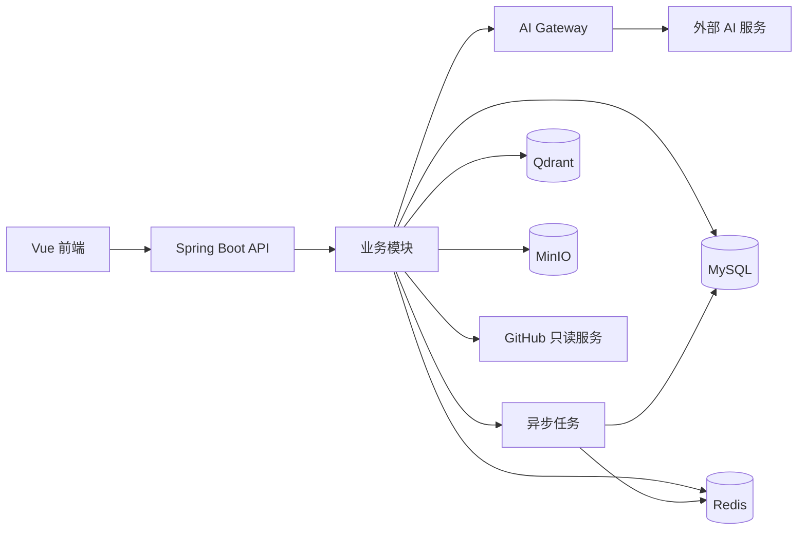

# 架构文档

本目录用于记录系统边界、组件关系、模块设计和关键技术视图。影响长期演进的具体决策应另行写入 [ADR](../adr/README.md)。

> 下图是目标架构概览，并非当前已部署架构。仓库目前处于 Planning / Foundation 阶段。

后端以模块化单体起步，各业务模块通过公开的应用服务边界协作。AI Gateway 隔离模型提供商；异步任务承载索引、分析等长耗时工作。只有出现真实的吞吐、资源隔离或独立发布需求时，才评估拆分 Worker。
