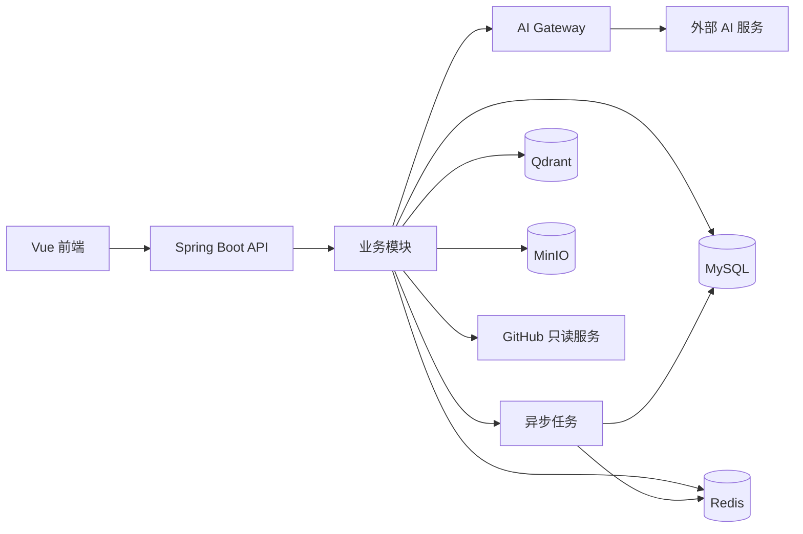

# 架构文档

本目录用于记录系统边界、组件关系、模块设计和关键技术视图。影响长期演进的具体决策应另行写入 [ADR](../adr/README.md)。

> 下图是目标架构概览，并非完整的当前部署图。仓库已实现应用侧对话状态、
> AI Gateway 和首个 OpenAI Responses 适配器，以及 knowledge 原文件存储边界。RAG、通用异步任务和其余外部集成仍是目标能力。

```mermaid
flowchart LR
    Web[Vue 前端] --> API[Spring Boot API]
    API --> Modules[业务模块]
    Modules --> AIG[AI Gateway]
    Modules --> Tasks[异步任务]
    Modules --> MySQL[(MySQL)]
    Modules --> Redis[(Redis)]
    Modules --> Qdrant[(Qdrant)]
    Modules --> MinIO[(MinIO)]
    Modules --> GitHub[GitHub 只读服务]
    AIG --> AI[外部 AI 服务]
    Tasks --> MySQL
    Tasks --> Redis
```

后端以模块化单体起步，各业务模块通过公开的应用服务边界协作。AI Gateway 隔离模型提供商；异步任务承载索引、分析等长耗时工作。只有出现真实的吞吐、资源隔离或独立发布需求时，才评估拆分 Worker。

knowledge 通过 project 公开应用服务检查所有权、锁定项目并分页发现软删除项目；不跨模块调用 Mapper。
原文件在私有对象存储，MySQL 管理归属、状态、幂等和容量。短事务预留/提交，远端 PUT/DELETE 在事务外；
恢复仅为模块内有界扫描，尚未建立通用任务平台。唯一 PUT 的完成证据和条件更新保证未知结果保留、终态不复活。
落实边界见 [ADR 0003](../adr/0003-knowledge-document-storage-and-recovery.md) 和[验收记录](../testing/knowledge-document-storage-acceptance.md)。
