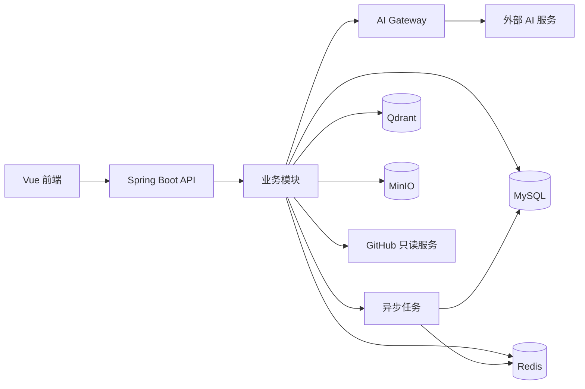

# 架构文档

本目录用于记录系统边界、组件关系、模块设计和关键技术视图。影响长期演进的具体决策应另行写入 [ADR](../adr/README.md)。

> 下图是目标架构概览，并非完整的当前部署图。仓库已实现应用侧对话状态、
> AI Gateway、OpenAI Responses 与 DeepSeek 官方对话适配器，以及 knowledge 原文件存储边界。RAG、通用异步任务和其余外部集成仍是目标能力。

```mermaid
flowchart LR
    Web[Vue 前端] --> API[Spring Boot API]
    API --> Modules[业务模块]
    Modules --> AIG[AI Gateway]
    Modules --> Tasks[异步任务]
    Modules --> MySQL[(MySQL)]
    Modules --> Redis[(Redis)]
    Modules --> Qdrant[(Qdrant)]
    Modules --> MinIO[(MinIO)]
    Modules --> GitHub[GitHub 只读服务]
    AIG --> AI[外部 AI 服务]
    Tasks --> MySQL
    Tasks --> Redis
```

后端以模块化单体起步，各业务模块通过公开的应用服务边界协作。AI Gateway 隔离模型提供商；异步任务承载索引、分析等长耗时工作。只有出现真实的吞吐、资源隔离或独立发布需求时，才评估拆分 Worker。

knowledge 通过 project 公开应用服务检查所有权、锁定项目并分页发现软删除项目；不跨模块调用 Mapper。
原文件在私有对象存储，MySQL 管理归属、状态、幂等和容量。短事务预留/提交，远端 PUT/DELETE 在事务外；
恢复仅为模块内有界扫描，尚未建立通用任务平台。唯一 PUT 的完成证据和条件更新保证未知结果保留、终态不复活。
落实边界见 [ADR 0003](../adr/0003-knowledge-document-storage-and-recovery.md) 和[验收记录](../testing/knowledge-document-storage-acceptance.md)。

DEV-017 继续在 knowledge 内提供显式文本处理和持久化有界扫描。MySQL 保存版本化片段、
处理状态、活动代、请求映射与文本额度，只有完整发布代可授权读取。
项目删除通过同步公开事件在同事务持久化取消，数据库扫描承担后续清理与恢复；
删除和发布共用项目/文档锁，原文件先清理时仍保留父文档直到派生内容清理结束。
解析使用固定 Unicode 字符窗口，不接入模型、向量投影或通用队列。
接口与验证见[处理 API](../api/document-processing.md)和[DEV-017 验收记录](../testing/document-processing-acceptance.md)。

DEV-020 的完整活动索引是文档向量投影的可见性边界。DEV-021 的 knowledge 检索服务先从 MySQL 取得完整活动来源组合，
通过独立 Embedding 能力生成固定 query 向量，再用 Qdrant 服务端归属/来源/排除过滤与 MySQL 二次校验完成有界补足。
查询和索引共享单个无队列推理槽及现有日 token/容量行，独立 query journal 保存未知操作，不依赖可删除父记录。
返回纯文本片段及版本/位置，不生成 RAG 回答；合同见[检索 API](../api/document-retrieval.md)。
