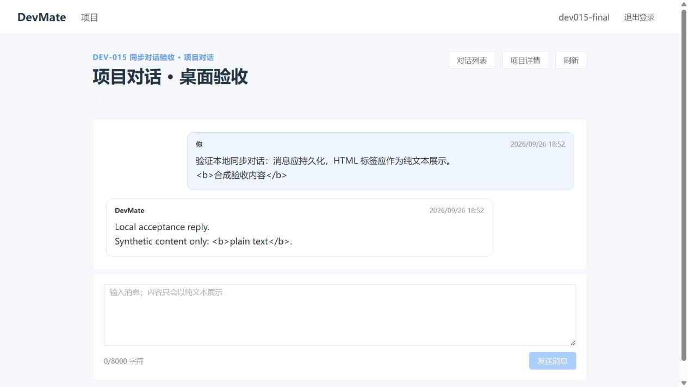
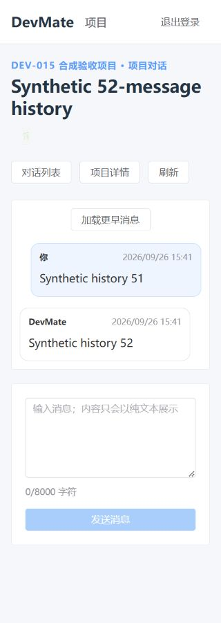

# 第二阶段 AI 对话验收记录

## 当前结论

本地自动检查、真实接口联调和下述浏览器场景已通过；PR 最新提交 CI 尚待核对，阶段结论暂为“未通过”。
本记录不代表所有者已确认第二阶段收口。任务范围见 [DEV-015](../tasks/DEV-015-ai-conversation-acceptance.md)，
复现步骤见[本地开发指南](../development/local-development.md)。

## 基线与环境

- 日期：2026-09-26；业务基线 `9ba5a7131658f3d3c52882f895f8879884d690c9`（DEV-014 PR #27 合并）。
- 实现分支：`chore/dev-015-ai-conversation-acceptance`；验收提交及 PR CI 在交付时补充。
- Windows；本地 JDK 21、Node 22.19.0、npm 10.9.3、Docker 29.2.1。
- 后端完整测试使用 MySQL 8.4.6 Testcontainers；联调使用独立 MySQL、Java 21 JRE、Node 22.19.0 Stub 容器。
- 后端 `127.0.0.1:18085`、Vite `127.0.0.1:15175`、浏览器故障代理 `127.0.0.1:15176`。
- 本次额外经过 `18086` 上游透传代理；复现只需指南中的单个浏览器侧代理，避免 Vite 转换网络错误。
- 浏览器为 Codex 内置 Chromium；所有账号、项目与消息均为合成数据。未执行真实模型冒烟，不需要真实模型账户。

## 自动检查与真实接口

命令使用仓库指定运行时，PowerShell 下 Maven 使用 `.cmd`。

| 检查                                                                   | 实际结果                                                                     |
| ---------------------------------------------------------------------- | ---------------------------------------------------------------------------- |
| `docker info`                                                          | 通过，Docker 29.2.1                                                          |
| `./devmate-server/mvnw.cmd -B -f devmate-server/pom.xml clean verify`  | 基线 74 个测试通过，0 失败、0 跳过                                           |
| `./devmate-server/mvnw.cmd -B -f devmate-server/pom.xml verify`        | 新增边界测试后 76 个测试通过，0 失败、0 跳过                                 |
| `npm ci`、`npm run type-check`、`npm run lint`、`npm run format:check` | 通过                                                                         |
| `npm run test`                                                         | 14 个测试文件、89 个测试通过                                                 |
| `npm run build`                                                        | 通过；保留既有大 chunk 告警，不调整打包策略                                  |
| `npm audit --registry=https://registry.npmjs.org`                      | 0 漏洞；默认 npmmirror 不支持审计，首次审计失败未当作通过                    |
| `node --test scripts/ai-stub.test.mjs`                                 | 最终 7 个 Stub 与代理自检通过                                                |
| `python -B scripts/check-conversation-api.py`                          | 真实 HTTP、MySQL 与 Stub 联调通过；权限、分页、重放、故障持久化与租约冲突    |
| 文档格式、链接和 diff 检查                                             | 通过；34 份 Markdown、63 个相对链接及变更格式检查通过，git diff --check 通过 |

新增后端测试用同步屏障复现：第一轮模型调用尚未返回时，第二个请求被 409 拒绝；人为推进隔离库租约时间后，
新一轮生成成功，旧响应返回 `AI_REQUEST_EXPIRED` 对应的 503，不能写入助手消息或覆盖新结果。
另一个测试验证 8000 个 emoji 可发送、8001 个和空白输入被拒绝。

首次新增租约测试误将旧请求过期预期写成 409，复测失败后按现有 `ErrorCode` 的 503 契约修正；
成功调用数、消息数和 FAILED/SUCCEEDED 状态断言保持不变。没有修改生产后端行为或 migration。

## 验收矩阵

| 场景                   | 结果与证据                                                                                                                                                                     |
| ---------------------- | ------------------------------------------------------------------------------------------------------------------------------------------------------------------------------ |
| AI 关闭                | 浏览器仍能创建、列表、详情、读取历史；发送显示 AI 暂不可用并保留草稿；后端集成测试验证 503 且无新增消息                                                                        |
| 创建与发送             | 浏览器注册、登录、项目详情入口、默认和自定义标题创建、Stub 回复及刷新持久化通过                                                                                                |
| 对话分页               | 15 个合成对话按 10/page 显示第二页 5 项；非法 `page=bad&pageSize=999` 规范化为 1/20                                                                                            |
| 消息分页               | 真实 API 连续生成 52 条消息，分页 50+2；浏览器另用固定数据首次显示 51/52，加载更早后显示 01 至 52，无重复                                                                      |
| 参数边界               | 现有前端输入/ID 测试、后端新增 Unicode 精确边界测试、接口脚本空白/超长/非法 UUID 通过                                                                                          |
| 所有权隔离             | 接口脚本用两个用户、两个项目验证全部对话 API 对他人及已删除项目返回 404；详情/历史/发送对错配和不存在对话返回 404                                                              |
| 身份与权限             | 无令牌真实接口 401、缺少 user authority 的后端集成测试 403；配置 30 秒会话后重新登录，中断恢复服务时旧会话正确跳转登录，页面不显示原项目数据；不声称测量了恰好 30 秒的切换时刻 |
| 相同 UUID 重放         | 真实接口同 UUID 返回相同结果；Stub 调用一次，MySQL 一条 invocation、两条消息                                                                                                   |
| 并发与租约             | 两个浏览器标签立即发送同会话，第二个出现冲突和手动确认入口，第一轮成功；租约过期及旧响应隔离见新增确定性测试                                                                   |
| 失败持久化             | 真实 Stub 的 429/503/无效响应/6.5 秒延迟分别得到安全 503/503/502/504；FAILED、IDLE 与同 UUID 不重调均验证                                                                      |
| 不确定网络结果         | 浏览器响应体截断后显示“网络状态不确定”；手动确认前后均为 3 次 Stub 调用、3 条 invocation、6 条消息，无重复生成                                                                 |
| 刷新失败               | 代理拒绝详情读取后可见失败与重试，已加载消息保留；恢复代理后重试成功                                                                                                           |
| 陈旧响应               | 现有确定性组件测试通过，覆盖路由切换、同路由刷新、旧发送结果；未宣称浏览器注入全部乱序组合                                                                                     |
| 草稿与刷新             | AI 关闭及明确故障保留草稿；成功后清空；刷新读取已持久化消息，不宣称取消后端调用                                                                                                |
| 安全文本、桌面和 320px | 脚本/HTML 标记按文本显示，长词换行；键盘 Ctrl+Enter 发送成功；窄屏横向溢出发现并修复，见下节                                                                                   |
| 审计与上下文           | 现有适配器、提示词和事务集成测试通过；真实响应合成 usage=13，失败元数据与租约释放核对通过                                                                                      |
| 日志与产物             | 不提交原始应用日志、数据库、凭据或 provider 正文；仅保存合成截图和统计；启动日志限制见下节                                                                                     |

## 修复与限制

- 320px 视口有垂直滚动条时，`clientWidth=305`，原 `body min-width:320px` 导致 `scrollWidth=320`。
  将约束改为 `min(320px, 100%)` 后，在 52 条长历史页面测得 `clientWidth=scrollWidth=305`；
  该浏览器实测是布局回归证据，不用 jsdom 的无布局模型代替。仅修改这一条全局宽度规则。
- Spring Boot 在隔离启动时曾打印自动生成的开发密码提示；不保存该输出。验收容器抑制对应自动配置日志类别，
  业务审计和认证保持原样。生产配置未修改，因此不声称本次完成了生产日志安全审计。
- 认证过滤器在 MVC trace filter 前拒绝的 401 响应没有 `X-Trace-Id`；辅助脚本只对进入应用的响应断言该头，
  不把认证失败改成成功。此限制单独记录，未修改响应契约。
- 浏览器可能透明重试响应头前的断连，Vite 又会转换上游错误；使用浏览器侧截断响应体才验证到应用手动恢复。
- 浏览器刷新后内存 UUID 丢失、JSON number 安全整数边界、同步调用时延和大 chunk 告警仍是现有限制。
- 没有验证真实模型质量、真实账户限流、生产网络/代理、分布式负载或生产费用治理；未启动 RAG、流式或工具能力。

## 截图

## 清理与人工确认

已停止本任务 Vite/代理，删除已核对标签的临时容器与数据库卷，关闭测试标签并恢复视口覆盖。
生成产物和本地日志位于忽略目录，不纳入提交。正式阶段收口及 PR 合并由项目所有者确认；不自动实施下一阶段。
