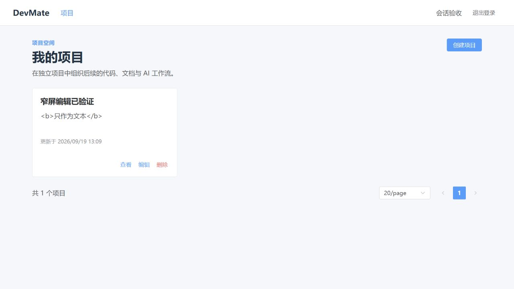
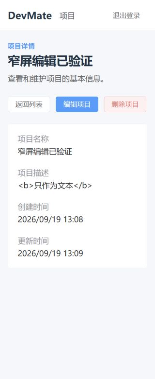

# 第一阶段验收记录

## 当前结论

本地自动检查、接口隔离验证与下列浏览器场景通过，验证通过待所有者确认。
陈旧请求使用现有确定性组件测试验证，未宣称完成真实浏览器网络乱序注入。
任务范围见 [DEV-012](../tasks/DEV-012-foundation-acceptance.md)，复现步骤见
[本地开发指南](../development/local-development.md)。

## 基线与环境

- 日期：2026-09-18 至 2026-09-19。
- 业务基线：`e8aad5ffc441b62ff4cc7d6f4fac09ce3e2f0c4e`。
- DEV-011 合并提交：`6c1bdbb1a5d29faec3dcb75b348c2085a2833eb4`，PR #22 已合并。
- CI 实现提交：`f75538d08628ced1cf69bd32f007f917b1fa3c16`；后续仅补充指南、记录与截图，不修改业务代码、依赖或 migration。
- 本地：Windows，JDK 21.0.7、Node 22.19.0、npm 10.9.3、Docker 29.2.1、MySQL 8.4.6。
- 浏览器联调：独立 Docker 网络与临时 MySQL，Java 21.0.12 Linux JRE 运行当前构建 JAR；后端 127.0.0.1:18080、Vite 127.0.0.1:15173。
- CI：Ubuntu 24.04、Temurin 21.0.12、Node 22.19.0、npm 10.9.3。

## 自动检查

命令在指南所列目录执行，全部实际成功退出（退出码 0）。

| 检查             | 实际命令                                                                       | 结果                                                                                |
| ---------------- | ------------------------------------------------------------------------------ | ----------------------------------------------------------------------------------- |
| Docker           | `docker info`                                                                  | 引擎可用，未跳过集成测试                                                            |
| 后端             | `./devmate-server/mvnw.cmd -B -f devmate-server/pom.xml clean verify`          | 57 tests，0 failures/errors/skipped；空库 Flyway V1–V4 与 MySQL Testcontainers 通过 |
| 前端安装         | `npm ci`                                                                       | 361 个包安装成功                                                                    |
| 类型、Lint、格式 | `npm run type-check`、`npm run lint`、`npm run format:check`                   | 全部通过                                                                            |
| 前端测试         | `npm run test`                                                                 | 10 个测试文件，55 个用例通过                                                        |
| 构建             | `npm run build`                                                                | 通过；主 JS 1042.45 kB，gzip 346.07 kB                                              |
| 审计             | `npm audit --registry=https://registry.npmjs.org`                              | 0 vulnerabilities                                                                   |
| 摘要             | `python scripts/summarize-tests.py`                                            | 输出 57 个测试、失败/错误/跳过均为 0；不上传原始 XML 或日志                         |
| 文档、YAML       | `node scripts/check-docs.mjs`、指南中的 `prettier --check`、`git diff --check` | 相对链接、格式与空白检查通过；工作流另经 GitHub 实际运行                            |

[首轮 CI](https://github.com/RyderChang/DevMate/actions/runs/35318136207)
对应实现 head `f75538d08628ced1cf69bd32f007f917b1fa3c16`，
`Foundation Backend` 与 `Foundation Frontend` 均成功，后端同样 57 个测试且无跳过。
验收记录本身提交后会产生新 head；最终 head SHA 与匹配的 CI run 在
[PR #24](https://github.com/RyderChang/DevMate/pull/24) 描述中登记，不能用上述首轮结果代替最终检查。

## 浏览器与接口矩阵

临时普通用户和项目只存在于本任务隔离数据库；未调用生产服务。浏览器通过产品表单操作，
权限矩阵另通过真实 HTTP API 执行，不把 Mock 结果当作接口联调。

| 场景                              | 结果与证据                                                                                                                     |
| --------------------------------- | ------------------------------------------------------------------------------------------------------------------------------ |
| 注册、登录、刷新、退出与保护路由  | 通过；注册后要求登录，刷新保留有效会话，退出后直接访问项目 URL 返回登录页                                                      |
| 空列表创建、详情、编辑与刷新      | 通过；创建导航详情，保存后字段更新，刷新读取服务端数据；表单边界另由组件测试覆盖                                               |
| 分页、页大小、前进后退与非法参数  | 通过；创建 11 项、10/page 到第二页，前进/后退与 URL 一致；非法 page/pageSize 规范化到 page=1&pageSize=20                       |
| 取消/确认删除、页末删除与详情跳转 | 通过；取消保留项目，确认返回列表；第二页唯一项删除后回第一页，总数 10；删除详情显示不可用                                      |
| B 访问 A 项目及列表隔离           | HTTP 联调通过；B 的读取、修改、删除均为 404，B 列表不包含 A 项目                                                               |
| 不存在、已删除项目统一 404        | HTTP 联调通过；与非所有者访问具有相同不可用语义                                                                                |
| 无令牌、过期令牌与会话清理        | 无令牌 HTTP 401；隔离后端设置 JWT_EXPIRATION=PT30S，过期后表单提交和详情刷新均返回登录页，不显示前一项目快照；重新登录恢复正常 |
| 网络失败与恢复                    | 通过；停止本任务后端后切换页大小，显示加载失败和重试；恢复后端并重试成功                                                       |
| 陈旧请求与快速路由切换            | 自动组件测试通过：详情旧响应、创建/编辑旧结果和删除旧结果不覆盖当前路由。未执行浏览器网络乱序注入                              |
| 桌面、320px 与键盘操作            | 通过；320px 创建、查看、编辑、删除可用；Tab、Enter 登录与表单提交；截图未见横向溢出                                            |
| 不可信名称/描述的文本显示         | 通过；名称及描述中的 `<b>` 标记按文本显示，没有渲染为 HTML                                                                     |

陈旧请求用例见
[详情测试](../../devmate-web/src/views/__tests__/ProjectDetailView.spec.ts)、
[列表测试](../../devmate-web/src/views/__tests__/ProjectListView.spec.ts)、
[表单测试](../../devmate-web/src/views/__tests__/ProjectFormViews.spec.ts)。

## 发现的问题与限制

- 本机宿主 JVM 启动曾出现 `Unable to establish loopback connection`；使用 Java 21 Linux 容器完成联调，未修改业务安全配置。宿主 JDK 21 的完整 Maven/Testcontainers 测试已成功。
- Docker 重启后临时数据库停止，恢复该容器后联调继续；不将此前的连接失败算作通过。
- 后端 README 的手工数据库授权漏写 `REFERENCES`，已补充以支持外键迁移；未修改已执行的 migration。
- JSON number 表示 BIGINT，前端仅接受正安全整数，未调整数据契约。
- 现有主 chunk 大于 500 kB；本任务记录告警，不改变依赖或打包策略。
- 未新增端到端测试框架，未部署，未实施第二阶段。真实浏览器网络乱序仍是验证方式的限制。
- 所有者需审核阶段结论与 PR；可按需把 `Foundation Backend`、`Foundation Frontend` 设为 required checks。未更改分支保护，未自动合并。

## 回滚与下一步

本任务仅 CI、文档和证据变更，可撤销对应提交；无数据库回滚。若检查已设为 required，
删除工作流前应先协调分支规则。下一任务建议确认统一 AI Gateway 与最小对话的契约、模型和预算后再立项。
